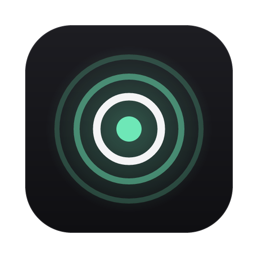
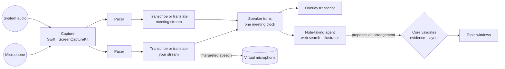

<p align="center">
  
</p>

<h1 align="center">Aura</h1>

<p align="center">
  <strong>A private copilot that sits beside you in customer meetings.</strong><br>
  Listen. Understand. Engineer. Act.
</p>

<p align="center">
  
  
  
  
</p>

---

Aura is a menu-bar app for macOS that listens to both sides of a call — your microphone and the meeting's audio, kept separate — and turns the conversation into small, private windows of notes that an AI agent arranges on your screen while you talk. It can interpret between languages in real time, draw diagrams of what is being described, and look things up on the web.

It was designed as an AI Sales Engineering copilot for BMC Helix sellers: an invisible senior engineer in every customer meeting. The original brief is in [INITIAL_PROMPT.md](INITIAL_PROMPT.md).

> **Prototype.** Aura listens, transcribes, takes notes, translates, suggests the next move, answers on request, writes up the meeting and saves it. Product answers are checked against BMC's public documentation only; approved internal knowledge is not connected yet. What has and has not been tested is tracked in [docs/verification.md](docs/verification.md).

## What it does

| | |
| --- | --- |
| **Two-sided live transcript** | Your microphone is `ME`; the Mac's system audio is `CUSTOMER`. Who is speaking is decided by which device the audio came from, never by a model's guess. |
| **Agent-run topic windows** | A note-taking agent opens a small window for each subject the meeting is actually about and keeps it up to date — what it says, which corner it sits in, how big it is. |
| **You have the last word** | Only you can close a window; closing one removes the topic and tells the agent not to bring it back. A window you drag stays exactly where you put it, and the agent arranges the others around it. |
| **The next move** | One suggestion at a time — usually a discovery question specific to what was just said — shown in the overlay and in the collapsed pill. It clears itself once you have asked, flags a definite claim you made about compatibility, pricing or dates with a safer way to put it, and stays quiet when nothing is worth an interruption. It never proposes or describes a product. |
| **What are we missing?** | Ask at any point (overlay button or ⌥Space) and Aura reviews the meeting so far and lists what discovery has not established, with the one gap to close first. |
| **Ask Aura anything** | From the palette (⌥Space): *What should I ask next? · Explain this · Can Helix do this? · Verify that · Search BMC docs · Give me an answer · Create architecture · Prepare demo · Compare with competitor · Show customer environment · What have we promised? · Summarize so far · Think deeply* — or type your own question. Product answers are searched in BMC's own documentation and marked **Verified** only when a page from bmc.com that the search really returned supports them; otherwise **Unverified**, with a safe thing to say. |
| **Meeting summary** | When you stop listening, Aura writes up the meeting: overview, environment, pain points, requirements, open questions, commitments and a suggested next step. Every listed item cites the turn it came from or is left out. Copy it as Markdown. |
| **Saved sessions** | Each meeting is saved with its transcript, notes and summary, and named by the AI from its summary. Open **Sessions…** from the menu bar or palette to read an old one, delete it, or **Continue** it: listening resumes with the old transcript and notes in place, and everything new is added to the same session. |
| **Notes you can trust** | Every note must cite a real turn of the conversation or it is discarded. Unanswered customer questions are marked `OPEN`; things you promised are marked `PROMISED`. |
| **Diagrams** | When someone describes how systems connect or a process flows, the agent draws it as a Mermaid diagram, from what was said only. |
| **Illustrations** | For ideas a diagram cannot express, a separate illustrator agent draws an image. It is captioned as an AI illustration. |
| **Web lookups** | The agent can search the web when a factual question comes up. Findings are shown apart from what was said, labelled `WEB`, with the site they came from — and only if a search actually returned that page. |
| **Live translation** | Interpret between your language and the meeting's, in 70+ languages: read the meeting in your language, hear it, and have your own voice interpreted for the others. |
| **Stays out of the way** | Floating panels above every app and Space that never take focus from your call. One shortcut hides everything. |

## How it works



Three rules shape the code:

1. **The webview only presents.** It never touches audio or talks to the network, and it is never sent a secret: a token can be typed into the app, but nothing reads one back out.
2. **The model proposes; the core decides.** Model output is schema-constrained and then validated in plain Rust — evidence for every note, a real search result behind every web claim, a layout that always fits the screen.
3. **Nothing is claimed that the platform cannot guarantee.** See [Privacy and limits](#privacy-and-limits).

| Layer | Technology |
| --- | --- |
| Interface | React + TypeScript in Tauri 2 webviews, shown as non-activating `NSPanel`s |
| Core | Rust — state machines, session pipeline, validation, layout |
| Native | Swift — ScreenCaptureKit capture, format conversion, audio playback |
| Realtime transcription | OpenAI GPT-Live |
| Translation | Gemini Live Translate |
| Note-taking agent and illustrator | OpenAI Responses API (web search and image generation tools) |

More in [docs/architecture](docs/architecture/architecture.md).

## Getting started

**Requirements:** an Apple silicon Mac on macOS 15 or later, Xcode command line tools, Rust (stable), Node 22+ and pnpm.

```bash
pnpm install
```

Put your tokens in a `.env` file at the repository root (it is gitignored):

```bash
OPENAI_API_TOKEN=...
GEMINI_API_TOKEN=...
```

The Gemini token is only needed for translation. You can also enter or replace either token in the app, under **menu bar → API Tokens…**; a token saved there is kept in your Keychain and takes precedence over `.env`.

```bash
pnpm dev
```

Then use the ring icon in the menu bar, or expand the overlay and press **Start listening**. macOS asks for **Microphone** and **Screen & System Audio Recording** the first time — the second is how macOS exposes system audio. Use headphones: without them the meeting's audio re-enters your microphone.

| Shortcut | Action |
| --- | --- |
| ⌥Space | Command palette |
| ⌘⇧. | Hide every Aura window; press again to restore |
| ⌥⇧Space | Expand or collapse the overlay |

### Useful commands

| Command | What it does |
| --- | --- |
| `pnpm test` | TypeScript and Rust tests |
| `swift test --package-path native/macos/AuraCapture` | Swift tests |
| `pnpm dev:web` | The interface in a browser on sample data. Add `?window=gallery` to see every topic window design |
| `cargo run -p aura-intel --example notes_bench` | Time the note-taking agent on a scripted conversation, no audio |
| `cargo run -p aura-intel --example advisor_bench` | Run the advisor and summarizer on a scripted conversation, no audio |
| `cargo run -p aura-session --example listen -- --fixtures <seller.pcm> <customer.pcm> --seconds 30` | A full session from audio files, printed to the terminal — no microphone or permissions |
| `fixtures/audio/make-fixture.sh <name> "<text>"` | Render synthetic speech for the command above |

Sessions that reach the AI providers are billed: two realtime sessions per second of listening, plus two small model calls per finished turn (notes and next move) and one larger call for each review or summary.

## Live translation

Open **menu bar → Translation** and choose:

1. **I Speak** — your language.
2. **Meeting Language** — the language of the call.
3. **What the meeting says** — leave it as spoken, show it in your language, or show and speak it.
4. **Translate my voice for the meeting** — your speech is interpreted and played into a virtual microphone.

Choices are saved and apply from the next session. Your interpreted words appear under each thing you say, so you can see what the meeting heard.

For the others to hear you, the meeting app must use a virtual microphone. Install the free [BlackHole](https://existential.audio/blackhole/) driver and restart your Mac:

```bash
brew install --cask blackhole-2ch
```

BlackHole is a silent pipe: whatever is played into it comes out as a microphone, and you hear none of it. Set it in exactly one place:

| Where | Setting | Value |
| --- | --- | --- |
| Your meeting app (Meet, Zoom, Teams) | **Microphone** | BlackHole 2ch |
| Your meeting app | **Speaker** | Your headphones |
| macOS → System Settings → Sound | **Output** | Your headphones or speakers — **never BlackHole** |
| macOS → System Settings → Sound | **Input** | Your real microphone |

If the Mac's own output is BlackHole you hear nothing at all and the meeting hears itself; Aura refuses to start translating in that state and says so. **Menu bar → Translation → Test Virtual Microphone** plays a short tone into BlackHole and reports whether it arrives.

To hear the meeting translated, choose **Show it and speak it to me**; the text-only option is silent. Switch the meeting app back to your normal microphone when you are not translating, or the others hear nothing.

Expect about three seconds before interpreted speech starts, and expect it to fall further behind in long turns. There is no voice picker: the model keeps the speaker's own voice, imperfectly.

## Install on another Mac

Build and package:

```bash
pnpm build
```

```bash
codesign --force --deep -s - target/release/bundle/macos/Aura.app && ditto -c -k --keepParent target/release/bundle/macos/Aura.app dist/Aura-macos-arm64.zip
```

The build is not notarized, so on the other Mac clear its download flag after moving it to Applications:

```bash
xattr -dr com.apple.quarantine /Applications/Aura.app
```

The packaged app contains no tokens. Open **menu bar → API Tokens…** and paste yours; they are saved to that Mac's Keychain and used from the next time you start listening. The window can save or remove a token but never displays one.

## Privacy and limits

- **Audio is never written to disk.** Each stream holds a few seconds in memory and is streamed to the AI provider for that stream.
- **Sessions are saved encrypted.** Transcript, notes and summary are written to `~/Library/Application Support/dev.aura.desktop/sessions`, encrypted with AES-256-GCM under a key kept in your Keychain; the files alone reveal nothing. Turn saving off with **menu bar → Save Sessions**, and delete any session from the Sessions window. Generated images are not kept.
- **Listening is always visible** in the overlay and the menu bar, including when Aura's windows are hidden. Recording and consent rules are yours to follow.
- **Aura cannot guarantee its windows are hidden from screen sharing.** Every window is flagged as excluded from capture, but Apple documents that flag as legacy and current capture is reported to ignore it. Share a single window or app rather than your whole screen, use ⌘⇧. to hide everything, or keep Aura on a display you are not sharing. Test it once with a colleague.
- **Suggestions are a model's judgement, not verified facts.** The advisor is told never to state what a product can do, and has no product knowledge to check against yet. "What are we missing?" and the summary's overview and next step are its own reading of the meeting.
- **Web searches leave your Mac.** The agent is told not to put names or confidential details into queries, but that is an instruction to a model, not a control. Turn web access off under **menu bar → Agent**.
- **Generated images can invent detail.** They are captioned, and the agent is told to prefer diagrams, which are held to the same evidence rule as notes.
- **Translation sends that stream's audio to Google** instead of OpenAI, and the others hear a synthetic version of your voice. Tell them an interpreter is in use.
- Logs go to `~/Library/Logs/Aura/aura.log` and contain event names and counts, never what was said.

The full analysis is in the [threat model](docs/security/threat-model.md).

## Project layout

```text
apps/desktop/             React interface (src/) and Tauri shell (src-tauri/)
crates/aura-core/         Platform-free logic: shell state, turns, topic validation, screen layout
crates/aura-audio/        Capture binding, playback, pacing, level metering
crates/aura-live/         GPT-Live client
crates/aura-translate/    Gemini Live Translate client
crates/aura-intel/        Note-taking agent and illustrator
crates/aura-session/      A listening session: two sources → turns → notes
native/macos/AuraCapture/ Swift: capture, format conversion, playback
prompts/                  Versioned prompts
fixtures/audio/           Script that renders synthetic speech for tests
docs/                     Product spec, architecture, decisions, threat model
```

## Documentation

- [Product specification](docs/product/product-spec.md)
- [Architecture](docs/architecture/architecture.md) · [macOS platform notes](docs/architecture/macos.md) · [AI architecture](docs/architecture/ai.md)
- [Decision records](docs/decisions/)
- [Threat model](docs/security/threat-model.md)
- [Verification status](docs/verification.md)

## Roadmap

| | |
| --- | --- |
| Done | Desktop shell · two-stream capture · live transcript · agent-run topic windows · diagrams · illustrations · web lookups · live translation · next-move suggestions · on-request answers with public-doc verification · meeting summary · saved, resumable sessions |
| Next | faster agent updates · echo handling · lowering the meeting's volume under an interpretation |
| Later | Approved internal knowledge (battlecards, compatibility matrices, demo catalog) · follow-up drafts (email, CRM) · retention policies · gateway-issued credentials |

## Known gaps

- The agent takes about 2–5 seconds to update after a turn ends, longer when it searches the web.
- No echo handling, and no reconnect if the network drops mid-session.
- Translating your own voice into a real meeting app has not been confirmed end to end.
- Development builds are ad-hoc signed, so macOS may ask for permissions again after a rebuild.
- Diagrams and images cannot be enlarged; window positions and shortcuts are not configurable.
- Requests that search the documentation take 15–25 seconds.
- Palette requests work only while listening, not yet on a saved session.
- After a rebuild of a development build, macOS may ask for your password to let the new build read its Keychain items (tokens and the session key).

## License

Proprietary. All rights reserved. Not licensed for redistribution.
