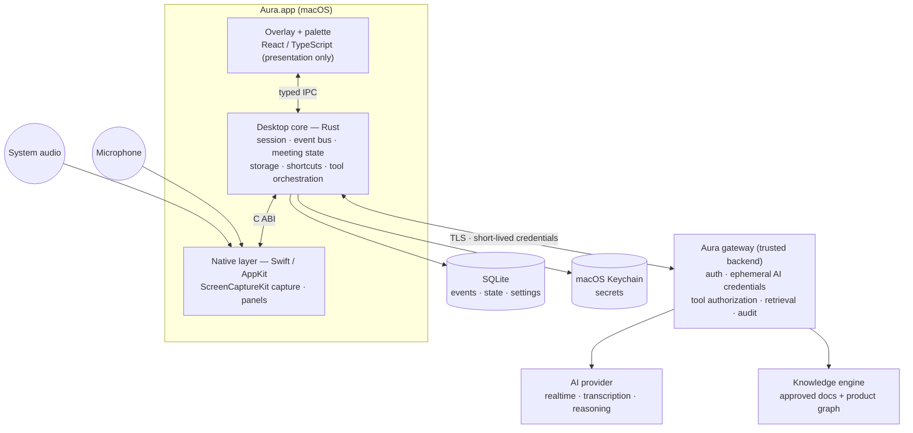
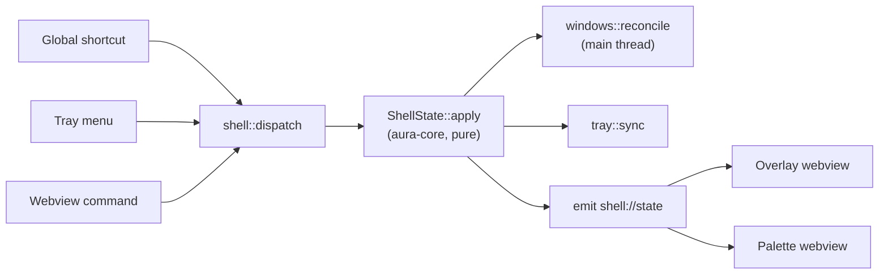
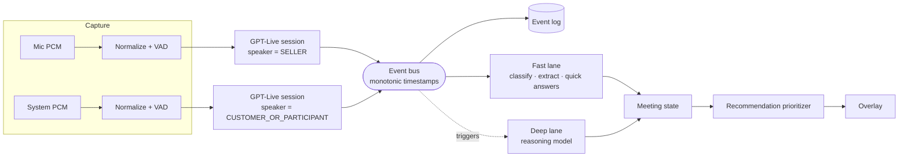

# Aura — Technical Architecture

Status: draft v0.1. Sections marked **Built** describe code in this repository; everything else is design.

## 1. Shape



Three rules hold the design together:

1. **The webview is presentation only.** It never talks to the network and never touches audio, and no secret is ever sent to it: the token window can submit a token for the core to store in the Keychain, but nothing returns one. Its only capability is a small typed IPC surface.
2. **Everything meaningful is a typed event.** UI, storage, replay and evaluation all consume the same event log. Nothing renders a model response directly.
3. **The model proposes; the core decides.** Authorization, verification state and what reaches the screen are decided in deterministic code.

## 2. Components

| Component | Language | Responsibility | State |
| --- | --- | --- | --- |
| `apps/desktop` (frontend) | TypeScript, React | Overlay, command palette | **Built** (shell only) |
| `apps/desktop/src-tauri` | Rust, Tauri 2 | Windows, tray, global shortcuts, IPC | **Built** |
| `crates/aura-core` | Rust | Platform-free domain logic. Today: shell state machine, turn assembly. Later: meeting state, prioritizer | **Built** (shell, turns) |
| `crates/aura-live` | Rust | GPT-Live WebSocket client: audio in, transcript and delegation events out | **Built**, verified live |
| `crates/aura-intel` | Rust | Schema-constrained model calls; topic note extraction from finalized turns | **Built**, verified live |
| `crates/aura-translate` | Rust | Gemini Live Translate client: continuous speech in, translated speech and both transcripts out | **Built**, verified live |
| `crates/aura-session` | Rust | One listening session: routes each source through a pacer and a realtime session into speaker turns | **Built**, verified with fixtures |
| `crates/aura-events` | Rust | Event types, envelope, replay | Milestone 4 |
| `crates/aura-audio` | Rust | Capture binding, wall-clock pacing with bounded drop-oldest buffering, level metering | **Built**. VAD and mute detection later |
| `native/macos/AuraCapture` | Swift | ScreenCaptureKit capture of system audio and microphone; conversion to 24 kHz mono PCM16 | **Built**; unverified on real devices |
| `crates/aura-storage` | Rust | SQLite, migrations, retention | Milestone 4 |
| `crates/aura-tools` | Rust | Tool registry, risk classes, approval | Milestone 9+ |
| `services/gateway` | TBD | Auth, ephemeral credentials, policy, audit, retrieval | Milestone 3 (mockable locally) |
| `knowledge/` | YAML | Products, capabilities, relationships, competitors | Milestone 7 |
| `prompts/` | Versioned files | One prompt per id, with schema and eval suite | `realtime/listener`, `extraction/topics`; eval suites not written yet |

Directories are created when their first real code lands, not before.

## 3. Desktop shell (Built)



- One `ShellState` (`overlayMode`, `hidden`, `clickThrough`, `paletteOpen`) lives in the Rust core. Every input becomes a `ShellCommand`.
- `ShellState::apply` is pure and unit-tested. While `hidden` is set, every command except restore is ignored — emergency hide is a promise that nothing appears.
- `reconcile` diffs previous and next state and touches AppKit only on the main thread.
- Webviews are projections: they read state, subscribe to `shell://state`, and send commands back. They hold no authority.

The same pattern — command → pure transition → reconcile → event — is what the meeting pipeline will use.

## 4. Meeting pipeline



- **Two streams, never mixed.** The operating system already tells us who is speaking; diarization is only needed later to tell customers apart.
- **Timestamps** are assigned on capture from one monotonic clock, so the two transcripts merge deterministically.
- **Pacing** (built): each stream passes through a pacer drained on a 100 ms tick that always yields one tick of audio — real samples when captured, silence otherwise. The realtime session's timeline therefore tracks the wall clock, which is what makes the two streams' timestamps comparable.
- **Backpressure** (built): the pacer holds at most 5 s per stream and drops oldest-first. Nothing buffers without limit and nothing is written to disk. Surfacing drops as a degraded state is still to do.
- **Turns** (built): the API marks no turn boundaries, so `aura-core` closes a turn after a 1.2 s pause, or at a sentence end once it has run 15 s. Because transcript text trails the audio, the silence check waits a further 1.2 s before finalizing.

### Event envelope

```jsonc
{
  "id": "evt_01J…",          // ULID
  "meetingId": "mtg_01J…",
  "seq": 1842,               // per-meeting, gap-free
  "at": 93812,               // ms since meeting start, monotonic
  "type": "CustomerPainDetected",
  "source": "extraction@3",  // component or prompt id + version
  "causedBy": ["evt_…"],     // turns or events this was derived from
  "payload": { }
}
```

The log is append-only and is the system of record; the meeting state is a fold over it. That is what makes `aura replay <meeting-id>` deterministic: replay feeds recorded transcript events through the same code, with model calls either re-run (evaluation) or served from recorded responses (UI tests and demos).

### Meeting state

Every item carries `value`, `kind` (`OBSERVED` / `RETRIEVED` / `INFERRED`), `confidence`, `evidence`, `sourceTurnIds`, `firstObservedAt`, `lastUpdatedAt`. Promotion between kinds is impossible: an inference can gain supporting observations, but it only becomes `OBSERVED` if a turn states it.

### Recommendation prioritizer

Eight engines (context, discovery, product, claim verification, competitive, commitment, architecture, meeting progress) emit *candidates*. One prioritizer chooses what — if anything — is shown, using interruption level, meeting phase, recency, and a rate limit. Engines cannot reach the overlay any other way.

### Topic windows and the note-taking agent (built)

Finalized turns go to a note-taking agent on its own channel, so a slow model call never delays the transcript. One request is in flight at a time; turns that arrive meanwhile are batched into the next, and a failed request's turns are retried with it.

**The agent adds and changes; the seller removes.** Each request shows the agent the windows on screen, the topics that have been put away, the titles of topics the seller closed, a few turns of context and the new turns. It answers with changes only: windows to add, and windows to change — in content, corner (one of four zones) or size (small, medium, large, or tall for a window with a visual). A window whose content is unchanged but should move is named by id alone (`keep`). Windows the agent does not mention stay exactly as they are, in the same order, so nothing shifts on screen because something else was updated.

The agent cannot close a window. If more than eight are open, the one untouched for longest is put away with its notes intact. Closing is the seller's act: it removes the topic from the board and adds its title to the list the agent is told not to recreate.

**The core decides what holds up.** `aura-core::topics` applies the arrangement under rules the agent cannot override:

| Rule | Why |
| --- | --- |
| New or changed notes must cite a turn from the batch just shown, or one already cited on the board | No invented notes; merging and splitting stay possible |
| A `Web:` note needs a source whose URL a search in that same request actually returned; otherwise the note is removed | No invented citations. A web claim appended to another note is split off and judged on its own |
| Placement is a zone and a size, never coordinates | `aura-core::layout` turns any arrangement into rectangles that are on screen, do not overlap, and stay out of the middle and out of the overlay's column — checked by a sweep over 500 mixed arrangements at the window limit |
| At most 8 windows and 16 topics | Glanceability and bounded state |

A refused content change still lets the agent move the window; the previous notes stay.

**Diagrams.** A window may carry Mermaid source written by the agent. It is content like a note: it needs turn evidence, and an oversized diagram is dropped rather than truncated. The webview renders it with Mermaid in strict mode (sanitized output, no links or scripts), loaded only when a diagram is shown; source that does not parse shows a one-line message and leaves the notes readable.

**Illustrator sub-agent.** For ideas a diagram cannot express, the agent writes a short brief. `aura-intel` hands the brief and that one topic's notes — not the transcript — to a second agent whose only tool is image generation. It runs in the background, so notes are never held up; the topic records `pending`, then `ready` or `failed`. The PNG stays in the Rust core and a window fetches it as raw bytes when told it is ready. A result for a brief that has since been replaced is discarded. Images are captioned as AI illustrations because the illustrator can invent detail; the prompt prefers diagrams.

| Rule | Why |
| --- | --- |
| A window has a diagram or an image, never both | One visual per glance |
| Layout collision-checks every placement; a window that does not fit is tried at each smaller size, then left out | The agent can ask for more than a screen holds; nothing may overlap or leave the screen |

**Web access.** With the seller's permission (menu bar, on by default, read at session start) the request carries the provider's web search tool. The prompt forbids putting names or confidential meeting details into queries, but that is an instruction to a model, not a control — queries do leave the machine. Web findings are kept visibly apart from what was said and are never presented as verified; proper verification against approved BMC sources is Milestone 8.

**The desktop makes the windows match.** It diffs the board against the open windows and opens, moves, resizes or closes them. A window the seller drags is pinned: the desktop notices any position it did not set itself, and from then on never moves that window — it only applies size changes in place — and passes its rectangle to the layout as an obstacle so other windows are arranged around it.

### The advisor and the summary (built)

Finalized turns fan out to three consumers on separate channels: the note-taker, the advisor, and an in-memory transcript kept for the end of the meeting.

**Next move.** After each finalized turn a fast model is shown the topic notes, the last ten turns and the suggestion currently on screen, and returns exactly one move — `ask`, `say`, `caution` or `none`. The core accepts it only if it cites a turn of this meeting; `none`, an empty move, or one citing nothing clears the suggestion. A move restated unchanged is not republished. One suggestion at a time is the whole interface: the overlay shows it, and the collapsed pill carries its text.

**What are we missing?** On request a stronger model reviews up to the last 200 turns and lists what discovery has not established. This is judgement about what was *not* said, so it cannot cite evidence and is presented as a suggestion.

**Summary.** When listening stops, the stronger model writes up the transcript. `aura-core::summary` keeps only items that cite a turn of the meeting; the overview and suggested next step are the model's wording and are labelled as such. The summary lives in memory until the next meeting replaces it, with a Markdown copy for the seller to take away. Nothing is written to disk.

All three prompts forbid proposing or describing products: there is no approved knowledge to verify against yet (Milestones 7–8), so the advisor's job is discovery, not positioning.

### Live translation (built; outgoing direction untested)

Each speaker's stream runs on one of two engines, chosen per session from the seller's settings:

| Engine | Provider | Audio in | Produces |
| --- | --- | --- | --- |
| Transcribe | GPT-Live | 24 kHz | Timestamped transcript |
| Translate | Gemini Live Translate | 16 kHz | Translated speech (24 kHz), text heard, text said |

The native layer converts each source to the rate its engine needs. Whatever is spoken, the transcript and notes read in one language: the seller's turns are always their own words, and the meeting's turns are the translation — or the original when the speaker was already using the seller's language.

| Direction | Stream | Target | Speech goes to | Same-language speech |
| --- | --- | --- | --- | --- |
| Incoming | System audio | Seller's language | Nowhere (text only) or the default output | Stay silent |
| Outgoing | Microphone | Meeting's language | A virtual microphone device | Repeat it, so the meeting still hears the seller |

A virtual audio device is the only way to put audio into a meeting app's microphone on macOS. Aura looks for one by name and refuses to start outgoing translation without it. Capture already excludes Aura's own audio, so spoken translations are not re-captured as meeting audio.

Known limits of this first version: the original and the interpretation overlap in the seller's ears (muting the original needs per-app audio taps, see [macos.md](macos.md#23-alternative-core-audio-process-taps)); the service does not timestamp text, so translated turns are placed by arrival time; no voice selection.

## 5. Trust boundary

| Zone | Trusted with | Never holds |
| --- | --- | --- |
| Webview | Rendering state | Secrets, network, audio, authorization |
| Desktop core | Session, local state, short-lived AI credential | Long-lived provider keys |
| Gateway | Provider keys, policy, tool authorization, audit | — |
| Model output | Nothing | Authority of any kind |
| Meeting transcript, retrieved documents | Nothing — they are data | Instruction priority |

Local development replaces the gateway with a mock behind the same interface. Detail: [ai.md](ai.md), [threat-model.md](../security/threat-model.md).

## 6. Storage and retention

SQLite with migrations from the first schema. Five data classes with **independent** retention policies:

| Class | Default |
| --- | --- |
| Transient audio | Memory only, seconds; never written |
| Transcript | Local, encrypted, policy-defined retention |
| Structured meeting state | Local, encrypted |
| Generated artifacts | Local until the seller exports |
| Audit log | Retained per enterprise policy; contains no transcript text |

Secrets live in the Keychain. "Do Not Save Session" keeps a meeting entirely in memory; "Delete Meeting" removes every class except audit metadata.

## 7. Failure behaviour

| Failure | Behaviour |
| --- | --- |
| Network lost | Keep capturing into local state where policy allows; show "Aura is offline. Live intelligence unavailable."; stale recommendations are withdrawn, not left on screen |
| Transcription fails | Degraded indicator; reconnect with backoff |
| Microphone or route changes | Detect, re-attach, log the transition |
| Rate limited | Queue deep work; shed fast-lane work with a visible state |
| Knowledge engine down | Answers still possible, always `UNVERIFIED` |
| Reasoning model down | Fast lane continues |
| Realtime model down | Capture and state continue; manual questions fall back to the reasoning model |

## 8. Observability

Structured JSON logs from the first build (the shell already emits them). Metrics cover session lifecycle, audio and socket state, per-stage latency (`audio captured → transmitted → partial → final → AI requested → first token → rendered`), token use and cost, and recommendation shown / opened / dismissed. Logs carry identifiers and timings, never transcript or document text; diagnostic bundles are redacted by construction.

## 9. Enterprise readiness

Not built, not blocked: identity comes from the gateway (SSO, RBAC); tenant id is part of every stored row and every retrieval filter; policy and feature flags are fetched configuration; models are chosen behind `RealtimeModel` / `TranscriptionModel` / `ReasoningModel` / `EmbeddingModel` / `RerankingModel` interfaces.

## 10. Windows

The Rust core, event model, storage and UI are portable. The native layer is not: capture (WASAPI loopback) and window behaviour need their own implementation behind the same interfaces. Nothing in the macOS implementation is compromised to keep that door open; `windows.rs` already isolates the panel code behind a `cfg` boundary.
