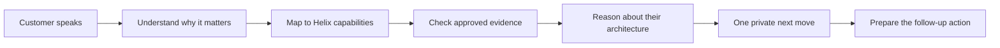

# Aura — Product Specification

> Listen. Understand. Engineer. Act.

Status: draft v0.1 · Scope: MVP · Source brief: [INITIAL_PROMPT.md](../../INITIAL_PROMPT.md)

## 1. Problem

A BMC Helix seller knows the customer but cannot hold the whole portfolio in their head, and a Solution Engineer cannot join every call. In a live technical conversation this shows up as:

| What happens in the meeting | Cost |
| --- | --- |
| An unexpected product or compatibility question | Seller guesses, or defers and loses momentum |
| A competitor or existing tool is mentioned | Seller pitches a replacement nobody asked for, or misses a real opening |
| Requirements surface gradually over 45 minutes | Discovery gaps are only noticed after the call |
| Seller makes a claim from memory | Unsupported claims reach the customer |
| Seller promises a follow-up | Commitments are forgotten |
| Call ends | An hour of notes, architecture sketches and emails |

Aura is a private, on-screen senior Solution Engineer: it hears both sides of the call, keeps a structured picture of the customer, and shows the seller **the one next technical move** — backed by evidence or explicitly marked as unverified.

It is not a note-taker, a call summarizer, or a chatbot. Summaries are a by-product of the meeting state, not the product.

## 2. Personas

| Persona | Needs from Aura | Fails them if |
| --- | --- | --- |
| **Account Executive** (primary) | The next question to ask; a safe answer to a technical question; confidence that what they say is supportable | It makes them read, or is wrong once with confidence |
| **Solution / Presales Engineer** (primary) | Evidence retrieval without leaving the call; architecture and demo prep from what was actually said; fewer early-stage calls to attend | It restates what they already know, or hides its sources |
| **Sales / SE manager** (later) | Aggregate discovery quality, not surveillance | It reads as employee monitoring |

Positioning: Aura gives every seller continuous access to senior technical intelligence so SEs can spend their time on the highest-value work. It does not replace them.

## 3. Core workflow

**Before** — optional two-minute briefing: objective, known environment, unknowns, recommended discovery.

**During** — a small always-on-top overlay. Collapsed it is a status pill. Expanded it shows three things: *Now*, *Ask next*, *Why*. The seller can summon a command palette (⌥Space) or push-to-talk to ask Aura directly. Aura stays silent unless it has something worth an interruption.

**After** — a deep reasoning pass turns the meeting state into a technical summary, open questions, commitments, a proposed architecture and a recommended next step. Anything that writes to another system is prepared, then approved by the seller.

### Product rules

These override feature requests.

1. **One recommendation at a time.** The prioritizer picks; engines do not write to the UI.
2. **Uncertainty over invention.** Compatibility, licensing, roadmap, security, pricing and support claims need a source. No source → `UNVERIFIED` and a safe thing to say.
3. **Observed, retrieved and inferred never merge silently.** Every item in the meeting state carries its kind, confidence and source turns.
4. **Understand before pitching.** A competitor mention is context until the customer expresses pain or intent.
5. **Never covert.** Listening state is always visible to the seller. Recording follows organizational policy and participant-consent requirements.
6. **Assist, don't act.** Nothing leaves the machine on the seller's behalf without explicit approval.

## 4. MVP

The MVP proves one claim: *Aura makes a seller significantly more technically capable during a live conversation.*

| Area | In the MVP |
| --- | --- |
| Desktop | macOS menu-bar app, floating overlay, command palette, global hide/show |
| Audio | Microphone (seller) and system audio (meeting) as separate streams; realtime transcription |
| Intelligence | Live meeting state; pain, technology and competitor extraction; Helix product mapping; next-best-question; manual questions; rolling summary |
| Knowledge | A small approved BMC documentation set; evidence retrieval; verification state; visible sources |
| Safety | Unverified-answer handling; no raw audio persistence by default |
| Post-meeting | Technical summary, open questions, commitments, recommended next step |

Acceptance is the scripted scenario in §59 of the brief (AWS / OpenShift / VMware / ServiceNow / Dynatrace customer; stale CMDB, alert overload, slow root cause), run end-to-end through event replay with no live meeting.

### Delivery order

Milestones 1–10 from the brief, each shippable on its own. **Milestone 1 (desktop shell) is built**; see the [README](../../README.md) for its exact state.

## 5. Non-goals (MVP)

- CRM write-back, automated email, or any autonomous external action
- Manager dashboards or analytics on individual sellers
- Windows, mobile, or browser clients
- A graph database, or more than a handful of connectors
- Spoken responses during a meeting
- Distinguishing individual customer speakers (diarization)
- Any guarantee that the overlay is invisible to screen sharing — macOS does not offer one (see [macos.md](../architecture/macos.md#5-screen-sharing-and-presentation-safe-mode))

## 6. Success metrics

Instrumented from the first pilot; none are claimed until measured, and none imply causation without a comparison group.

| Category | Metric | How it is measured |
| --- | --- | --- |
| Usefulness | Suggested questions actually asked | Seller-turn match against the active suggestion |
| Usefulness | Recommendations opened vs dismissed | Overlay interaction events |
| Technical quality | Share of technical answers shown with evidence | Verification state on answered questions |
| Technical quality | Unverified seller claims flagged | Claim-verification events |
| Technical quality | Discovery topics still unknown at meeting end | Meeting-state gaps |
| Distraction | Level ≥1 recommendations per 10 minutes | Prioritizer output; target is *low* |
| Latency | Finalized customer statement → suggestion rendered | Pipeline timestamps (target < 2 s) |
| Productivity | Minutes from call end to follow-up sent | Seller-reported in pilot |
| Trust | "Would you take your next technical call without it?" | Pilot survey |

Any score shown in the product (technical fit, discovery completeness) must have a documented model and be explainable from the meeting state. Until then it is not shown.

## 7. Risks

| Risk | Why it matters | Mitigation |
| --- | --- | --- |
| **Trust** | One confidently wrong answer ends adoption | Verification states, mandatory provenance, hallucination evals gating every prompt or model change |
| **Distraction** | Too many prompts make it unusable mid-call | One recommendation, interruption levels, a rate metric with a ceiling |
| **Latency** | A good answer 30 seconds late is useless | Fast lane separate from deep lane; measured, not assumed |
| **Knowledge freshness** | Docs and the portfolio change | Product knowledge is data with version and date metadata, updated without an app release |
| **Screen sharing** | The overlay can appear in a shared screen | Layered presentation-safe mode and an emergency hide; honest documentation of the limit |
| **Surveillance perception** | Sellers will reject a monitoring tool | Seller-owned data, visible listening state, no manager view in the MVP |
| **Privacy and consent** | Customer speech is sensitive and regulated | No raw audio at rest by default; retention as policy; consent handled per organizational and legal requirements before any real-meeting pilot |
| **Over-automation** | Unexpected actions damage customer relationships | Approval model; the model never authorizes |

## 8. Open questions

1. Which BMC documentation set is approved for the MVP corpus, and who owns its refresh?
2. What are BMC's recording and consent policies per region? This gates the Phase 1 pilot, not development.
3. Does the backend run in BMC's own tenancy, and are there data-residency constraints on the AI provider?
4. Which distribution path — Developer ID with notarization, or MDM?
