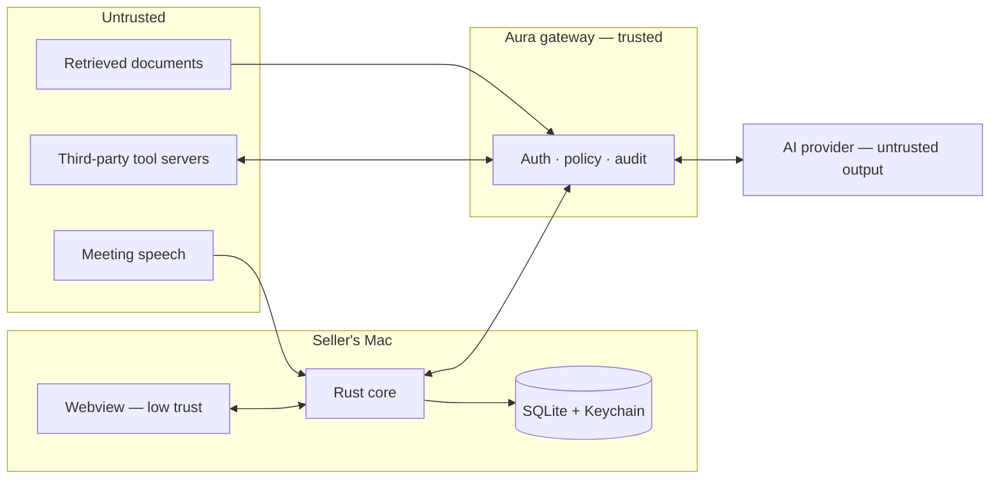

# Aura — Threat Model

Status: draft v0.1. Method: assets → trust boundaries → threats (STRIDE-informed) → controls. "Built" marks controls present in the Milestone 1 code; everything else is a requirement on later milestones.

## 1. Assets

| Asset | Why it matters |
| --- | --- |
| Customer meeting audio and transcripts | Confidential customer information; regulated in many jurisdictions |
| Structured meeting state and generated artifacts | Condensed, searchable version of the above |
| Internal BMC knowledge (battlecards, pricing, roadmap, security docs) | Commercially sensitive; some must never reach customers |
| AI provider credentials | Cost and data exposure |
| User identity and session | Gate to everything else |
| Tool capabilities (CRM, email, calendar) | Ability to act in the seller's name |
| The seller's screen | The overlay may show private guidance during a screen share |

## 2. Trust boundaries

Model output is untrusted on both sides of every call: it can be wrong, and it can be steered by untrusted input.

## 3. Threats and controls

| # | Threat | Vector | Controls |
| --- | --- | --- | --- |
| T1 | **Provider key theft** | Key extracted from the app bundle, webview, logs or disk | **Development today:** a long-lived token in a gitignored `.env`, read only by the Rust core, redacted in `Debug`, never sent to the webview — acceptable on a developer machine, not in any distributed build. **Target:** long-lived keys only in the gateway. Desktop receives short-lived client secrets with the session configuration bound server-side; held in Rust memory only, never sent to the webview, never persisted. Secrets that must persist go in the Keychain, never SQLite |
| T2 | **Prompt injection via customer speech** | A participant speaks instructions | Transcript is data, never instruction role. Extraction is schema-constrained. Components reading transcripts hold no write or external tools. Authorization is never a model decision. Injection cases in the eval suite |
| T3 | **Prompt injection via retrieved documents** | A poisoned or compromised document | Same structural controls as T2. Only approved sources are indexed; ingestion records who approved what. Evidence is quoted with provenance, so a poisoned source is attributable |
| T4 | **Compromised internal knowledge** | An attacker or mistake alters an approved document | Document ids, versions and content hashes in the index; changes are reviewable; `VERIFIED` requires a passage that matches product and version, limiting how far one bad chunk reaches |
| T5 | **Unauthorized document access** | A seller, or a model on their behalf, retrieves material above their audience | `allowedAudience` filtering in the retrieval service from the authenticated identity, applied before ranking. The client cannot supply its own audience |
| T6 | **Cross-customer leakage** | One customer's meeting content appears in another's context | Meeting and tenant ids on every row and every retrieval filter. Meeting content is never added to the shared knowledge index. Prompt assembly takes exactly one meeting id |
| T7 | **Local transcript theft** | Malware or another user reads the database; a lost laptop | Transcripts and state encrypted at rest with a Keychain-held key; retention limits; "Do Not Save Session"; "Delete Meeting". Raw audio is never written by default, so it cannot be stolen from disk |
| T8 | **Tool abuse** | A model is manipulated into a harmful action | Tool registry with risk classes; schema validation; approval bound to the exact arguments shown to the seller; `EXTERNAL` always confirmed; full audit. The MVP has no `WRITE` or `EXTERNAL` tools |
| T9 | **Malicious or compromised MCP server** | A tool server returns hostile content or over-broad tools | Allowlisted servers only, proxied through the gateway; tool descriptions pinned at approval time; responses treated as untrusted data (T3 controls); per-tool data-classification limits |
| T10 | **Model attempts an unauthorized action** | Hallucinated or steered tool calls | The orchestrator, not the model, checks permission and approval on every call. An unknown tool or invalid arguments is an error, not a best effort |
| T11 | **Webview compromise** | Script injection through rendered content | **Built:** strict CSP (`default-src 'self'`, IPC only); no remote content; capabilities limited to events and window dragging; four IPC commands, none of which take free-form paths or URLs. Later: all model text rendered as text, never as HTML |
| T12 | **Overlay exposed in a screen share** | Seller shares the whole display | **Built:** emergency hide (⌘⇧.) enforced in the state machine; best-effort content-protection flag. Later: Presentation Safe Mode. Documented honestly as not guaranteeable on macOS |
| T13 | **Covert recording / consent failure** | Aura listens without participants' knowledge or outside policy | Listening state always visible to the seller; no hidden capture mode; recording and retention are enterprise policy, not client settings; consent requirements resolved with legal before any real-meeting pilot |
| T14 | **Confidently wrong technical claim** | Hallucination presented as fact | Verification states computed from evidence; strict classes cannot be `INFERRED`; `UNVERIFIED` is the default when retrieval fails; hallucination rate gates releases |
| T15 | **Sensitive data in logs or telemetry** | Transcript text in diagnostics | **Built:** structured logs carry event names and state flags only. Later: log schema with typed fields; redacted diagnostic bundles; audit log holds identifiers, not content |
| T16 | **Supply chain** | A malicious dependency in the app | Lockfiles committed; `tauri-nspanel` is a git dependency pinned by `Cargo.lock` — pin to a reviewed revision or vendor before any distribution; dependency audit in CI; signed and notarized builds only |
| T18 | **Meeting content leaking through web searches** | The note-taking agent turns something said in the meeting into a search query | Web access is the seller's choice (menu bar) and is a session option policy can force off. The prompt forbids names and confidential details in queries — a mitigation, not a control. Later: a query filter in the core, and domain allow-listing to approved documentation |
| T19 | **Hostile web page steering the agent** | A search result contains instructions or false claims | The agent's only power is arranging note windows; it has no other tools. Its output is schema-constrained and validated: notes still need turn evidence, web notes need a URL the search really returned, and they are labelled as web findings to check, never as verified |
| T20 | **Untrusted diagram source rendered in a window** | The agent, possibly steered by meeting or web content, emits hostile Mermaid | Mermaid `securityLevel: strict` (sanitized SVG, no click handlers or links); the app's CSP allows no remote content or inline script; source is length-limited and parsed before rendering |
| T21 | **Generated image misleads the seller** | The illustrator invents components or relationships | The illustrator sees only a brief and one topic's notes; output is captioned as an AI illustration; diagrams, which are evidence-checked text, are preferred; the seller can turn images off |
| T22 | **A second provider receives meeting audio** | Translation sends a stream's audio to Google instead of OpenAI | Off by default; the seller chooses it per language pair and the overlay shows when it is active. Needs the same data-processing sign-off as the first provider. Development uses a long-lived token from `.env`, sent as a header and never in a URL; the service offers constrained short-lived tokens for production |
| T23 | **Synthetic voice heard by participants** | Outgoing translation speaks in a replicated version of the seller's voice; incoming replicates participants' voices to the seller | Product guidance to tell participants an interpreter is in use; consent and biometric-voice rules to be checked with legal before any real-meeting use |
| T24 | **Token exposure through the in-app token window** | A token is typed into a webview | Entry is one-way: the window submits a token to the core, which stores it in the Keychain; no command returns a token, only whether one is present and its source. The field is a password input that is cleared on save, the token is validated and never logged, the window is closed by emergency hide, and the CSP allows no remote content that could observe it |
| T17 | **Surveillance misuse** | Aura's data used to monitor employees | No manager-facing view of individual meetings in the MVP; meeting data owned by the seller's account; aggregate metrics only, by policy |

## 4. Standing rules

1. Meeting content and retrieved documents never become higher-priority instructions.
2. The model never decides authorization.
3. No secret reaches the webview.
4. No raw audio at rest unless a recording policy explicitly enables it.
5. Observed, retrieved and inferred information stay distinguishable from capture to screen.
6. Nothing is described as a guarantee that the platform does not guarantee.

## 5. Residual risks accepted for now

- Screen-share exposure when the seller shares an entire display and does not hide Aura.
- A fully compromised device defeats local encryption while the user is logged in.
- Transcription and reasoning are processed by a third-party AI provider; contractual and residency terms are an open question in the product spec.
- `macOSPrivateApi` (transparent windows) relies on private WebKit API and could break on an OS update.

## 6. Review triggers

Re-run this model when: audio capture lands (Milestone 2), the gateway gets its first real endpoint (Milestone 3), the first `WRITE` tool is proposed, any third-party MCP server is added, or before any pilot with real customer meetings.
